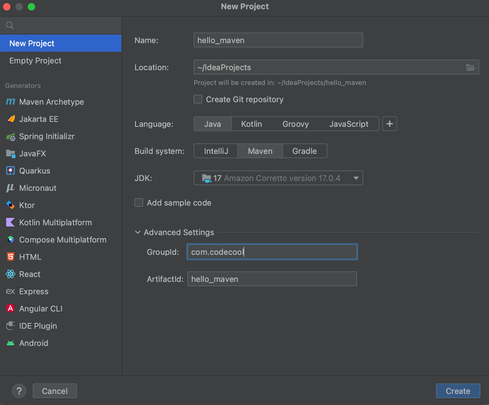
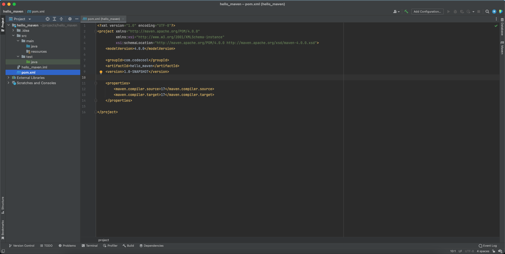
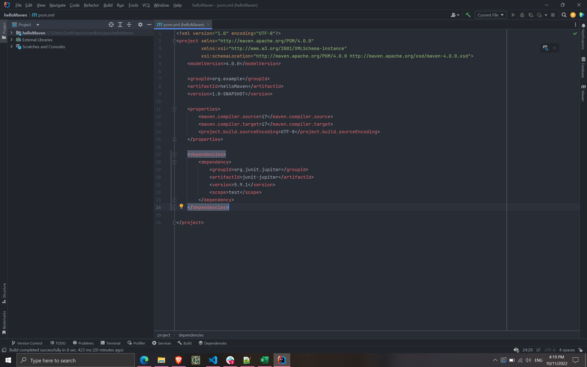

# What is Maven?

According to the [official documentation](https://maven.apache.org/index.html), "Apache Maven is a software project
management and comprehension tool. Based on the concept of a project object model (POM), Maven can manage a project's
build, reporting, and documentation from a central piece of information."

Maven follows a convention over configuration model, meaning, that Maven will help you to configure your projects based
on conventions. As a junior software developer, it is unlikely, that you should not rely on conventions, so that's good
news. Practically, Maven helps you to build your Java applications, manage your dependencies, run tests for your
application, create a JAR file, and many more.

We will use Maven in all of our Java applications. This tutorial aims to help you understand Maven concepts in practice.

## Create a Maven Project in IntelliJ

1. Open IntelliJ, and choose the New Project option.
2. On the left sidebar, pick New Project.
   
3. On this tab, you can set the following properties:

* Name:: This will be your application's name
* Location:: Where the project's folder should be put on your computer
* If you open the Advanced settings menu, you can set up more project-specific information:
    * GroupId: It is a convention, to put the company name here. You can use com.codecool in your projects.
    * ArtifactId: The name of the jar without version. Also, convention to match the project name.

4. Click to Create.
5. Maven just created your project based on the information you provided. The project structure is also a convention to
   follow, so Maven could do it easily. Let's take a look at the pom.xml!

## The pom.xml


The pom.xml is the heart of a Maven project. You can find all information describing a project here - the groupId, the
artifactId, the version, and also the Java version.

Also, we keep our dependencies here.
To use any outside library, we need to add to our project as a dependency - as our project depends on that library.
Maven does this by having its own repository of libraries which we can use by describing the library which we need from
that repository. Imagine this like writing down a list of book titles that you need for an essay and handling it towards
a librarian, who helps you gather them from the library.

Let's say, that you would like to use the library called JUnit Jupiter. This is a library that lets you develop and
execute unit tests - you are going to use it a lot as you progress with the course. For now, don't worry too much about
how it works. To include it in our project, we need to visit the https://mvnrepository.com/, search for JUnit Jupiter.
Select the third result (Aggregator) and then the latest version in the list that comes up. Copy the xml from the Maven
tab. (More easily, search on Google for JUnit Jupiter maven and the first result will take you to the same place.) We
need to copy the following block to our pom.xml:

```xml

<dependencies>
    <dependency>
        <groupId>org.junit.jupiter</groupId>
        <artifactId>junit-jupiter</artifactId>
        <version>5.9.1</version>
        <scope>test</scope>
    </dependency>
</dependencies>
```

Before that, let's take a quick look at that first:

* `<dependencies>`: we need to list all our dependency libraries between the `<dependencies>` tag and its closing
  tag `</dependencies>`
* `<dependency>`: this tells Maven, that we need a library in our project with the following parameters
* groupId: familiar, isn't it? This block describes the library or the company or author to who it belongs.
* artifactId: it's also not a stranger here. The artifactId tells the name of the library.
* version: Now, this becomes important. While we don't need that in our project, you will need to pay attention to the
  version of that library.
    * When you import a new library to your project from https://mvnrepository.com/, it's a good practice to choose a
      new, but popular version - this can save you from using versions with known bugs or issues.
* scope: You can specify when a dependency is included in a classpath. For example provided indicates you expect the JDK
  or a container to provide the dependency at runtime. If we are using libraries related to testing, we should use the
  test scope.
  Knowing what we have, let's copy-paste this dependency into our pom.xml! The pom.xml should look like this:



An error appeared, and along with it, a Maven icon should appear on the upper-right area, Load Maven Changes. By doing
so, you tell Maven to fetch these libraries in its repository, download these files, and tailor it to your project. Well
done, you appended your project with the Junit Jupiter library!
If you need
help [importing a Maven project](https://www.jetbrains.com/idea/guide/tutorials/working-with-maven/importing-a-project/),
please, follow this quick tutorial.

Finishing the application
Congrats on getting started with Maven! For now, we do not advise going any deeper using Maven, as it is a very complex
tool, and it's easy to get lost in it. Instead, let's finish our application by displaying a welcome message.

Right click on the java folder in the project explorer and select New -> Package. Enter the package name:
com.codecool.helloMaven. After that, right click on the created package and select New -> Java class. By convention, the
main entry point of a Java program is always called Application, so let's give it that name. Then, inside the
application class, paste the following code:

```java
public static void main(String[] args){
    System.out.println("Hello Maven!");
}
```

Running the project should display the message "Hello Maven!" to the console. Congratulations! This concludes our Maven
tutorial.