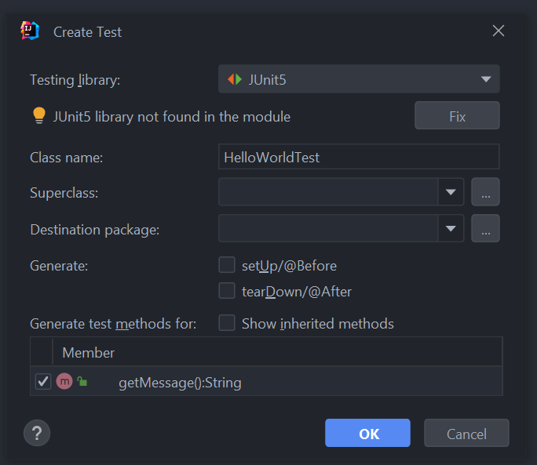

# Introduction to Testing step-by-step guide

In this guide, we will help you to solve the above-mentioned project, and we will explain everything about it.

## Create a Maven project

This task is quite easy, and we have a tutorial page about it which can be found here.

Notes :

* The project name should be introduction_to_testing.
* Be sure to add JUnit to your project, by adding the code below to pom.xml:

```xml

<dependencies>
    <dependency>
        <groupId>org.junit.jupiter</groupId>
        <artifactId>junit-jupiter</artifactId>
        <version>5.9.0</version>
    </dependency>
</dependencies>
```

## Create a HelloWorld class

I think you created a few classes before, but if you have not, just right-click on the java source root and create a new
class called HelloWorld.

Inside the class, we need to create a new function which responsible for returning the welcome message. Let's call it
getMessage(), and it should look something like this:

```java
public String getMessage() {
    return "Hello World!";
}
```

## The first test

Now, we should start creating our Unit test classes right? No, since we are using this beautiful IDE, called IntelliJ we
have a much simpler way to create our test class.

Let's go back into our HelloWorld class and click inside the class name. After that hit Alt + Enter (on Mac it's
Control + Enter) and you should see a few options which we can choose from. Click on Create test and you should see this
window:



Don't forget to click in the clickbox at the bottom of the window because that's responsible for creating our test case
for getMessage().

As you can see our IDE just created a HelloWorldTest class for us with the getMessage() method.

Inside the test method, we are going to use the Arrange, Act, Assert (AAA) syntax.

First we create a HelloWorld object by calling it's constructor. This is the Arrange phase. Then we call the
getMessage() method on the object, and store the result into a string variable. This is the Act phase. Finally we check
that the result is indeed what we expect. This is the Assert phase.

```java
@Test
void getMessage() {
    HelloWorld helloWorld = new HelloWorld();
    String message = helloWorld.getMessage();
    String expected = "Hello World!";
    assertEquals(expected, message);
}
```

The assertEquals method is provided by the JUnit framework. It is used to test the equality of two objects.

So if you click on the little green "arrow" in the right corner (or hit Shift + F10, on Mac, it's Control + R), the
JUnit execution engine will run your test. If your test turns green, it means your function is working as expected! :)

## A more complex example

To showcase an example that is a bit more advanced, we are going to create a Calculator class with a method called
sum(), which is responsible for adding two integers.

```java
public int sum(int number1, int number2) {
    return number1 + number2;
}
```

An example test for this method would look like this:

```java
@Test
void sum() {
    Calculator calculator = new Calculator();
    int number1 = 2;
    int number2 = 3;
    int result = calculator.sum(number1, number2);
    assertEquals(5, result);
}
```

Feel free to experiment further with the test cases! You can also add more functions to the Calculator and write some
test for those. Good luck!